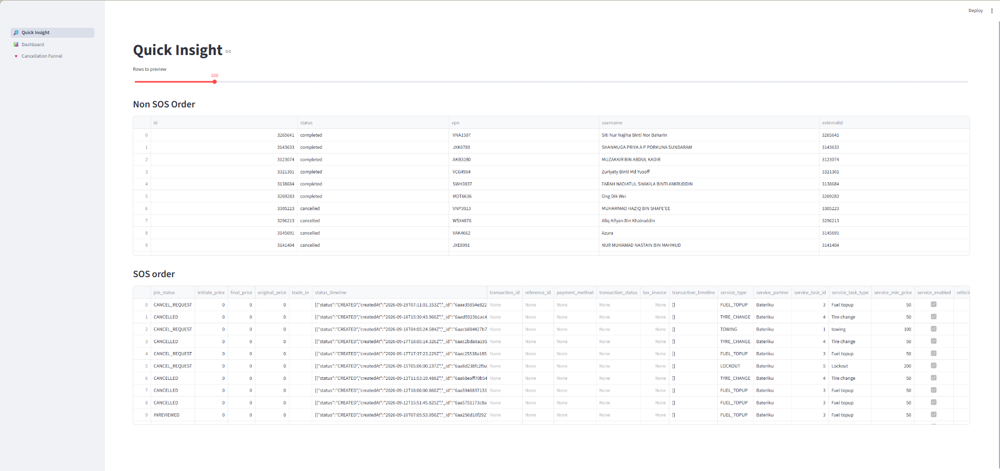
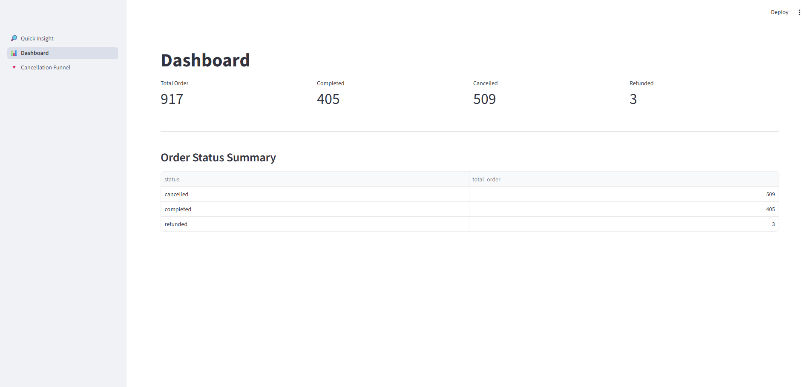
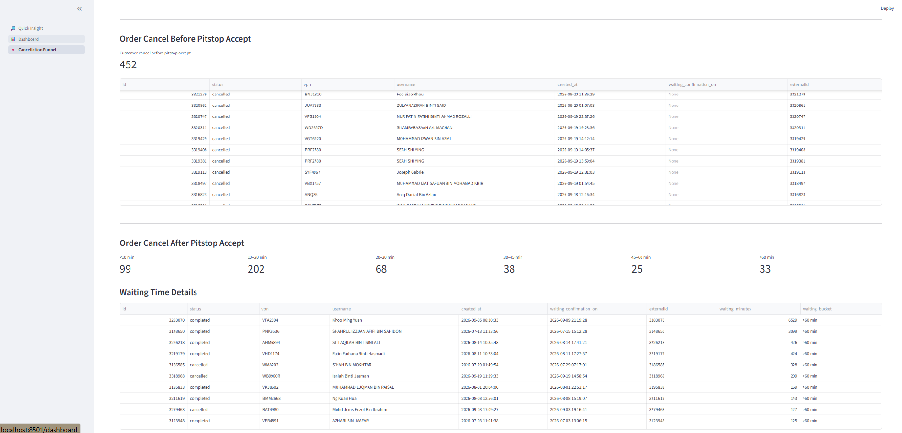

# Setel Order Analysis Dashboard

A data analysis and reconciliation dashboard built with **Python, SQL, DuckDB, Pandas and Streamlit** to analyze Setel order data.

## 📊 Quick Insight page



## 📈 Dashboard Page

## 📉 Cancellation Funnel


## 🎯 Project Objective

This project was developed to analyze Setel order data and support:

- Order reconciliation
- Order matching between datasets
- SOS vs non-SOS order analysis
- Cancellation analysis
- Cancellation funnel analysis
- Data quality investigation
- KPI monitoring

## 🔍 Order Matching

Orders are matched between the `partner` and `orders` tables using the order ID:

```sql
CAST(partner.id AS VARCHAR) = orders.externalid
```

SOS orders are excluded from the non-SOS order analysis.

### Total Matched Orders

```sql
SELECT
    COUNT(DISTINCT p.id) AS total_order
FROM partner p
INNER JOIN orders o
    ON CAST(p.id AS VARCHAR) = TRIM(o.externalid)
WHERE o.externalid NOT LIKE 'SOS%';
```

### Cancelled Orders

```sql
SELECT
    COUNT(DISTINCT p.id) AS total_cancel_order
FROM partner p
INNER JOIN orders o
    ON CAST(p.id AS VARCHAR) = TRIM(o.externalid)
WHERE o.externalid NOT LIKE 'SOS%'
  AND p.status = 'cancelled';
```

## 📈 Dashboard Features

### Quick Insight
- Non-SOS order matching
- SOS order analysis
- Order status overview
- Data preview

### Dashboard
- Total orders
- Cancelled orders
- Cancellation rate
- KPI monitoring

### Cancellation Funnel
- Cancellation by stage
- Order cancellation analysis
- Identification of cancellation patterns

## 🛠️ Technology Stack

| Technology | Purpose |
|---|---|
| Python | Data processing and application logic |
| SQL | Data analysis and reconciliation |
| DuckDB | Local analytical database |
| Pandas | Data manipulation |
| Streamlit | Dashboard development |
| Git / GitHub | Version control |

## 💡 Skills Demonstrated

- SQL JOIN operations
- Data reconciliation
- Data validation
- Data cleaning
- Exploratory data analysis
- KPI development
- Dashboard development
- Data quality investigation
- Python data analysis
- DuckDB analytics

## 📁 Project Structure

```text
setel/
├── app.py
├── db.py
├── duckdb_ui.py
├── load_data.py
├── requirements.txt
├── views/
│   ├── dashboard.py
│   ├── quick_insight.py
│   └── cancellation_funnel.py
└── README.md
```

## 🔒 Data Privacy

The repository does not expose confidential customer or transaction data. Production datasets are excluded from the public project.
